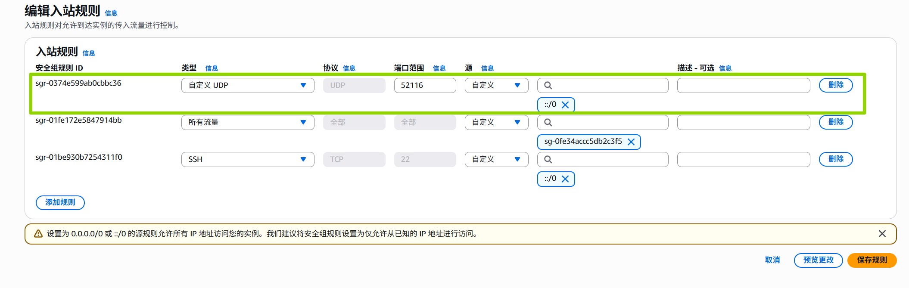
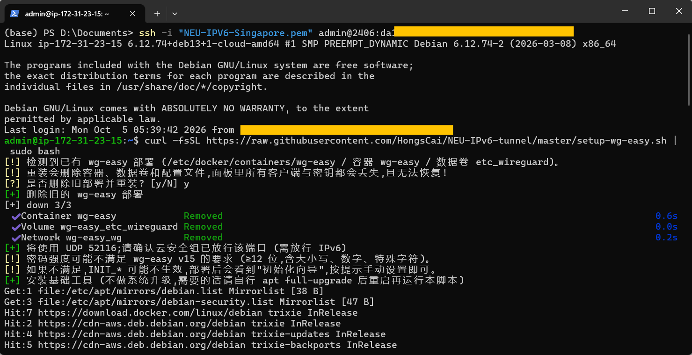
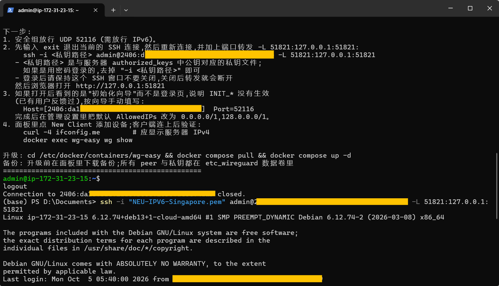
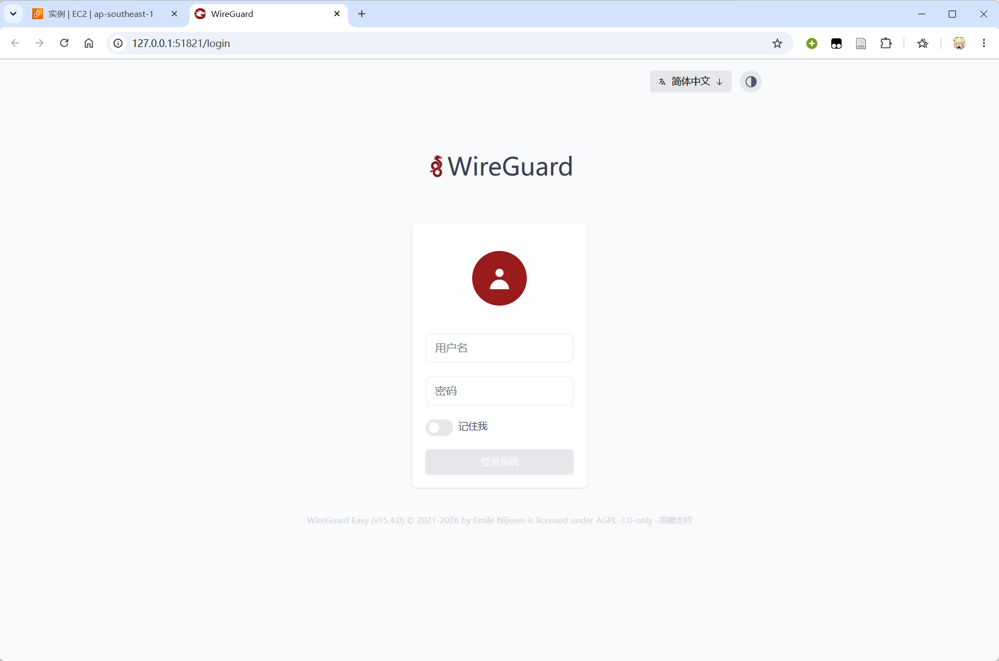
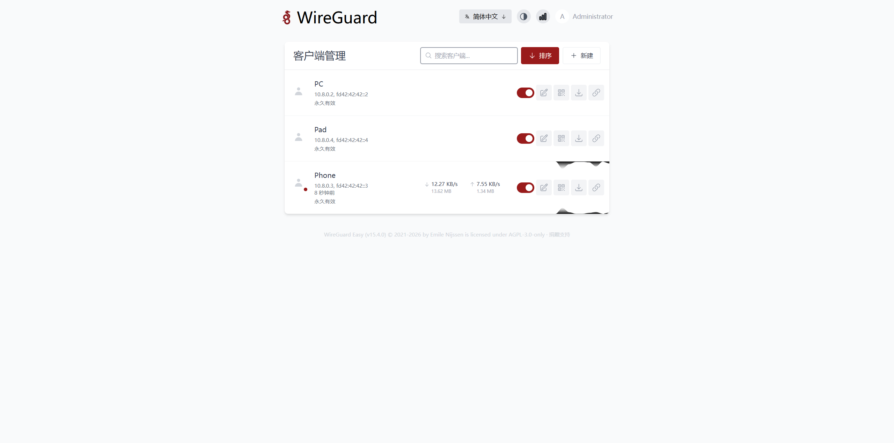
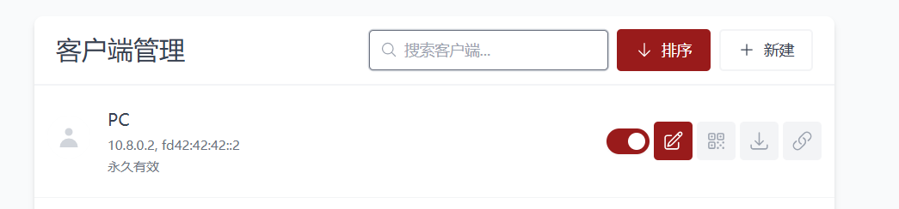
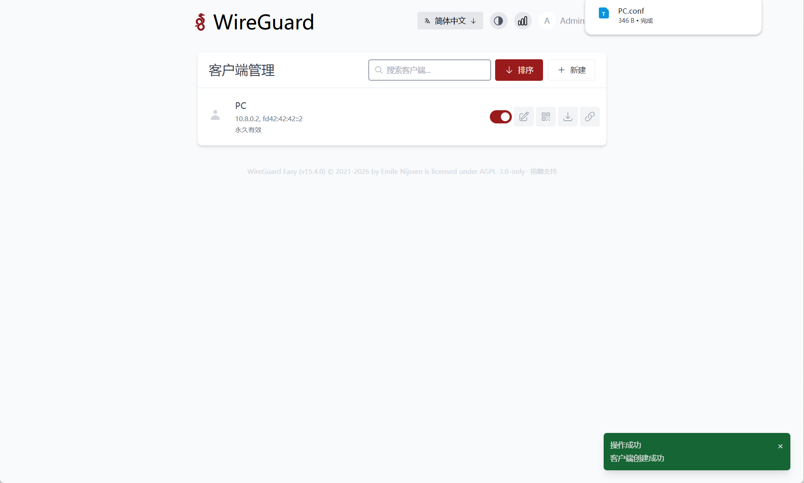
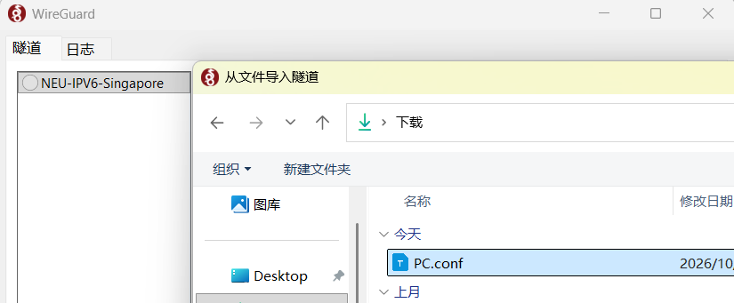
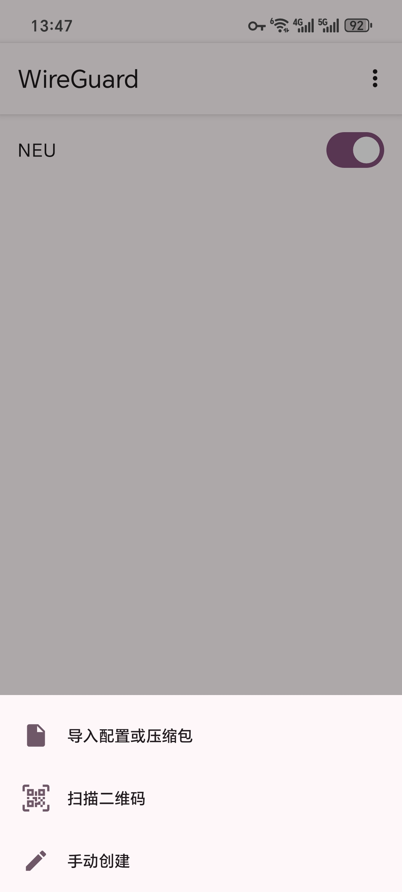

# NEU-IPv6-tunnel

仅供学习交流，请遵守学校网络使用规定。


利用 NEU 教育网 IPv6 免流的特点，用 WireGuard 把电脑的 IPv4 流量封装进 IPv6 隧道，发往云服务器，再由服务器的 IPv4 出口访问互联网。


```
客户端
  |
  | IPv6 UDP WireGuard
  |
  ↓
云服务器 (IPv6 Endpoint)
  |
  | WireGuard Tunnel (IPv4 only)
  |
  ↓
公网 IPv4 出口
  |
  ↓
Internet
```


- 校园教育网里只看到电脑与服务器之间的 IPv6 流量。
- 只转发电脑的 IPv4 流量，IPv6 流量照常直连，不经过隧道。
- 服务器上用 wg-easy 管理客户端，面板只监听本机，通过 SSH 转发访问。


## 前置工作

准备好一个云服务器（有公网IPv6）

> AWS 可以免费用一年【建议云服务器使用 新加坡的 香港的被严肃风控】 【有100GB的出站流量免费额度】
>
> Azure 可以GitHub学生认证免费用一年


云服务器的安全组放行 UDP `52116`  （需放行 IPv6）


## 服务端部署

登录自己的云服务器

>例如下面用私钥登录
>
>```shell
>ssh -i "NEU-IPV6-Singapore.pem" admin@2406:da1x:xxxx:xxxx:xxxx:xxxx:xxxx:xxxx
>```


直接运行

```bash
curl -fsSL https://raw.githubusercontent.com/HongsCai/NEU-IPv6-tunnel/master/setup-wg-easy.sh | sudo bash
```

默认自动探测服务器 IPv6，WireGuard 端口 `52116`，账号 `admin` / `123456789123` 。


>如果要自定义运行可以带参数运行：
>
>改动了 port 的话需要调整上面云服务器的安全组放行的 port
>
>```bash
>curl -fsSL https://raw.githubusercontent.com/HongsCai/NEU-IPv6-tunnel/master/setup-wg-easy.sh | sudo bash -s -- --port 52116 --password 'Your-Passw0rd!'
>```
>
>| 选项                    | 默认值                   | 说明                             |
>| ----------------------- | ------------------------ | -------------------------------- |
>| `--host`                | 自动探测 IPv6            | 客户端连接的域名或地址           |
>| `--port`                | `52116`                  | WireGuard UDP 端口               |
>| `--user` / `--password` | `admin` / `123456789123` | 面板账号                         |
>| `--dns`                 | `1.1.1.1`                | 客户端 DNS                       |
>| `--ipv4-cidr`           | `10.8.0.0/24`            | 隧道 IPv4 网段                   |
>| `--allowed-ips`         | `0.0.0.0/1,128.0.0.0/1`  | 客户端默认 AllowedIPs            |
>| `--harden-ssh`          | 关                       | 禁用 SSH 密码登录 (需已配置公钥) |
>| `--reinstall`           | 关                       | 已有部署时不询问，直接删除重装   |





部署后

先 `exit` 退出当前 SSH 连接，再建立 SSH 转发 (登录后保持窗口不要关闭)：

```bash
ssh -i <私钥路径> root@<服务器IPv6> -L 51821:127.0.0.1:51821
```


用密码登录的话可以去掉  `-i <私钥路径>`



然后浏览器打开 [http://127.0.0.1:51821](http://127.0.0.1:51821/)


## 管理面板配置



默认账号：admin

默认密码：123456789123




新建客户端



在客户端配置的高级选项中 MTU建议设置为 1360，一些浏览器图片加载不出来的时候可以适当调低 1360 -> 1340 -> 1320

> 给电脑使用的客户端建议保活间隔设置为 25，手机去设置貌似有点费电


## 客户端导入

> WireGuard 的客户端下载连接：https://www.wireguard.com/install/
>
> 安卓可以直接在google play里下载到


电脑通过下载的conf配置文件导入






手机平板直接扫码导入即可




然后就可以美美上网咯


## 管理

重装：再次运行脚本，按提示确认即可 (会清空旧数据)。服务器重启后会自动启动。


如果在重启前手动执行过 `docker stop wg-easy`，重启后它不会自动起来。要恢复就执行 `docker start wg-easy`，之后正常重启就又会自启了。


```shell
# 升级
cd /etc/docker/containers/wg-easy && docker compose pull && docker compose up -d

# 卸载 (会删除所有客户端)
cd /etc/docker/containers/wg-easy && docker compose down -v
rm -rf /etc/docker/containers/wg-easy /root/wg-easy-credentials.txt
```


